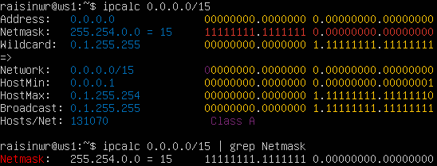
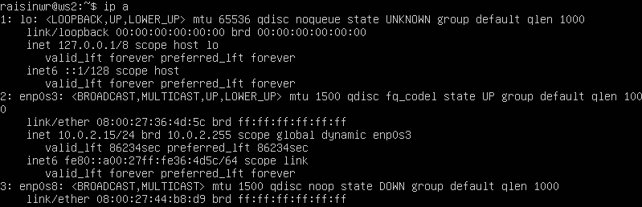

## Linux Network

## Содержание

- Part 1. [Инструмент ipcalc](#part-1-инструмент-ipcalc)
	- 1.1. [Сети и маски](#11-сети-и-маски)
	- 1.2. [localhost](#12-localhost)
	- 1.3. [Диапазоны и сегменты сетей](#13-диапазоны-и-сегменты-сетей)

- Part 2. [Статическая маршрутизация между двумя машинами](#part-2-статическая-маршрутизация-между-двумя-машинами)
	- 2.1. [Добавление статического маршрута вручную](#21-добавление-статического-маршрута-вручную)
	- 2.2. [Добавление статического маршрута с сохранением](#22-добавление-статического-маршрута-с-сохранением)

- Part 3. [Утилита iperf3](#part-3-утилита-iperf3)
	- 3.1. [Скорость соединения](#31-скорость-соединения)
	- 3.2. [Утилита iperf3](#32-утилита-iperf3)

- Part 4. [Сетевой экран](#part-4-сетевой-экран)
	- 4.1. [Утилита iptables](#41-утилита-iptables)
	- 4.2. [Утилита nmap](#42-утилита-nmap)

- Part 5. [Статическая маршрутизация сети](#part-5-статическая-маршрутизация-сети)
	- 5.1. [Настройка адресов машин](#51-настройка-адресов-машин)
	- 5.2. [Включение переадресации IP-адресов](#52-включение-переадресации-ip-адресов)
	- 5.3. [Установка маршрута по-умолчанию](#53-установка-маршрута-по-умолчанию)
	- 5.4. [Добавление статических маршрутов](#54-добавление-статических-маршрутов)
	- 5.5. [Построение списка маршрутизаторов](#55-построение-списка-маршрутизаторов)
	- 5.6. [Использование протокола ICMP при маршрутизации](#56-использование-протокола-icmp-при-маршрутизации)

- Part 6. [Динамическая настройка IP с помощью DHCP](#part-6-динамическая-настройка-ip-с-помощью-dhcp)

- Part 7. [NAT](#part-7-nat)

- Part 8. [Дополнительно. Знакомство с SSH Tunnels](#part-8-дополнительно-знакомство-с-ssh-tunnels)

## Part 1. Инструмент **ipcalc**

### 1.1. Сети и маски

Сначала нужно установить утилиту `ipcalc` следующей командой:

```
sudo apt install ipcalc
```

- Определить и записать:

	- Адрес сети `192.167.38.54/13`: `ipcalc 192.167.38.54/13`

		
	> `192.168.0.0/13`

	- Перевод маски `255.255.255.0` в префиксную и двоичную запись, `/15` в обычную и двоичную, `11111111.11111111.11111111.11110000` в обычную и префиксную

		- Перевод маски `255.255.255.0` в префиксную и двоичную запись: `ipcalc 255.255.255.0`	
		
			
			> Префиксная запись: `24`<br>Двоичная запись: `11111111.11111111.11111111.00000000`

		- Перевод маски `/15` в обычную и двоичную: `ipcalc 0.0.0.0/15` 
		
			 
			> Обычная запись: `255.254.0.0`<br>Двоичная запись: `11111111.11111110.00000000.00000000`

		- Перевод маски `11111111.11111111.11111111.11110000` в обычную и префиксную 
		Утилита `ipcalc` не воспринимает двоичную запись, поэтому переведем заданное число в десятичную форму и проверим перевод через `ipcalc`: `ipcalc 255.255.255.240/28` 
		
			 
			> Обычная запись: `255.255.255.240`<br>Префиксная запись: `28`


	- Минимальный и максимальный хост в сети `12.167.38.4` при масках: `/8`, `11111111.11111111.00000000.00000000`, `255.255.254.0` и `/4`

		- Минимальный и максимальный хост в сети `12.167.38.4` при маске: `/8`: `ipcalc 12.167.38.4/8`
		
			
			> Минимальный хост в сети: `12.0.0.1`<br>Максимальный хост в сети: `12.255.255.254`

		- Минимальный и максимальный хост в сети `12.167.38.4` при маске: `11111111.11111111.00000000.00000000`: `ipcalc 12.167.38.4/16`
		
			
			> Минимальный хост в сети: `12.167.0.1`<br>Максимальный хост в сети: `12.167.255.254`

		- Минимальный и максимальный хост в сети `12.167.38.4` при маске: `255.255.254.0`: `ipcalc 12.167.38.4/23`
		
			
			> Минимальный хост в сети: `12.167.38.1`<br>Максимальный хост в сети: `12.167.39.254`

		- Минимальный и максимальный хост в сети `12.167.38.4` при маске: `/4`
		
			
			> Минимальный хост в сети: `0.0.0.1`<br>Максимальный хост в сети: `15.255.255.254`

### 1.2. localhost

- Определить и записать, можно ли обратиться к приложению, работающему на `localhost`, со следующими `IP`: `194.34.23.100`, `127.0.0.2`, `127.1.0.1`, `128.0.0.1`

	- `ipcalc 194.34.23.100`

		> Нельзя

		

	- `ipcalc 127.0.0.2`

		> Можно

		

	- `ipcalc 127.1.0.1`

		> Можно

		

	- `ipcalc 128.0.0.1`

		> Нельзя

		

> **Результат:**<br>Можно: `127.0.0.2`, `127.1.0.1`<br>Нельзя: `194.34.23.100`, `128.0.0.1`

### 1.3. Диапазоны и сегменты сетей

- Определить и записать:

	- Какие из перечисленных IP можно использовать в качестве публичного, а какие только в качестве частных: `10.0.0.45`, `134.43.0.2`, `192.168.4.2`, `172.20.250.4`, `172.0.2.1`, `192.172.0.1`, `172.68.0.2`, `172.16.255.255`, `10.10.10.10`, `192.169.168.1`

	- `ipcalc 10.0.0.45`

		> Частный

		

	- `ipcalc 134.43.0.2`

		> Публичный

		

	- `ipcalc 192.168.4.2`

		> Частный

		

	- `ipcalc 172.20.250.4`

		> Частный

		

	- `ipcalc 172.0.2.1`

		> Публичный

		

	- `ipcalc 192.172.0.1`

		> Публичный

		

	- `ipcalc 172.68.0.2`

		> Публичный

		

	- `ipcalc 172.16.255.255`

		> Частный

		

	- `ipcalc 10.10.10.10`

		> Частный

		

	- `ipcalc 192.169.168.1`

		> Публичный

		

		> **Результат:**<br>Публичные: `134.43.0.2`, `172.0.2.1`, `192.172.0.1`, `172.68.0.2`, `192.169.168.1`<br>Частные: `10.0.0.45`, `192.168.4.2`, `172.20.250.4`, `172.16.255.255`, `10.10.10.10`

- Какие из перечисленных IP адресов шлюза возможны у сети `10.10.0.0/18`: `10.0.0.1`, `10.10.0.2`, `10.10.10.10`, `10.10.100.1`, `10.10.1.255`

	- `ipcalc 10.10.0.0/18`

		

		> **Результат:** `10.10.0.2`, `10.10.10.10`, `10.10.1.255`

## Part 2. Статическая маршрутизация между двумя машинами

- Поднять две виртуальные машины

- В настройках каждой машины выставляем `Connection type`: `Internal Network`, важно, чтобы имя внутренней сети было одинаковое у обеих машин.

	

	После запуска устанавливаем hostname каждой из виртуальных машин:

	**ws1:**
	```
	sudo hostnamectl set-hostname ws1
	```

	**ws2:**
	```
	sudo hostnamectl set-hostname ws2
	```

	

- С помощью команды `ip a` посмотреть существующие сетевые интерфейсы.
	
	- Скриншоты с вызовом и выводом использованной команды.

		**ws1:**
		
		

		**ws2:**
		
		

- Описать сетевой интерфейс, соответствующий внутренней сети, на обеих машинах и задать следующие адреса и маски: `ws1` - `192.168.100.10`, маска `/16`, `ws2` - `172.24.116.8`, маска `/12`.

	> В данном случае был включен новый сетевой интерфейс `enp0s8`, соответсвующий внутренней сети у обеих виртуальных машин.

	- Скриншоты с содержанием измененного файла `etc/netplan/00-installer-config.yaml` для каждой машины.
	
		**ws1:**

		
	
		**ws2:**

		

- Выполнить команду `netplan apply` для перезапуска сервиса сети.

	


### 2.1. Добавление статического маршрута вручную

- Добавить статический маршрут от одной машины до другой и обратно при помощи команды вида `ip r add`. Для этого воспользуемся следующей командой: `ip r add <address to connect> dev <network name>`.

- Скриншот с выполнением команды и пингом виртуальных машин между друг другом.
	
	

### 2.2. Добавление статического маршрута с сохранением

- Перезапустить машины. Для этого воспользуемся командой `reboot`.

- Добавить статический маршрут от одной машины до другой с помощью файла `etc/netplan/00-installer-config.yaml`.

	- Скриншоты с содержанием изменённых файлов `etc/netplan/00-installer-config.yaml`.

		**ws1:**

		

		**ws2:**

		

- Пропинговать соединение между машинами.

	- Скриншот с вызовом и выводом использованной команды.

		

## Part 3. Утилита **iperf3**

Сначала нужно установить утилиту `iperf3` следующей командой:

```
sudo apt install iperf3
```

### 3.1. Скорость соединения

- Перевести и записать в отчёт: `8 Mbps в MB/s`, `100 MB/s в Kbps`, `1 Gbps в Mbps`.

	- `8 Mbps в MB/s`: **8 Mbps = 1 MB/s**

	- `100 MB/s в Kbps`: **100 MB/s = 819200 Kbps**

	- `1 Gbps в Mbps`: **1 Gbps = 1024 MB/s**

### 3.2. Утилита **iperf3**

- Измерить скорость соединения между ws1 и ws2.

	- Скриншоты с вызовом и выводом использованных команд. 
		
		Для выполнения данного задания запустим виртуальную машину `ws1` в качестве сервера, используя команду: `iperf3 -s` (`-s` -> `server mode`).

		**ws1:**

		

		А вторую виртуальную машину `ws2` в роли клиента с помощью команды: `iperf -c 192.168.100.10 -f K` (`-c` -> `client mode`, `-f` -> `format`, `K` -> `KBits`)

		**ws2:**

		

## Part 4. Сетевой экран

### 4.1. Утилита **iptables**

- Создать файл `/etc/firewall.sh`, имитирующий фаерволл, на `ws1` и `ws2`. Для этого на каждой из виртуальных машин пропишем соответсвующую команду: `sudo touch /etc/firewall.sh`.

- Нужно добавить в файл подряд следующие правила:

	1. На `ws1` применить стратегию, когда в начале пишется `запрещающее` правило, а в конце пишется `разрешающее` правило (это касается пунктов 4 и 5).
	2. На `ws2` применить стратегию, когда в начале пишется `разрешающее` правило, а в конце пишется `запрещающее` правило (это касается пунктов 4 и 5).
	3. Открыть на машинах доступ для `порта 22` (`ssh`) и `порта 80` (`http`). 
	
		Для выполнения данного пункта необходимо прописать следующие команды: `iptables -A INPUT -p tcp --dport 22 -j ACCEPT` и `iptables -A INPUT -p tcp --dport 80 -j ACCEPT` (`-A` - добавить правило, `INPUT` - обработка входящих пакетов, `-p tcp` - указание протокола `tcp`, `--dport 22/80` - порт назначения пакета, `-j ACCEPT` - опция для указания, что делать с пакетами, в данном случае принимать).

	4. Запретить `echo reply` (машина не должна «пинговаться», т.е. должна быть блокировка на `OUTPUT`).

		Для выполнения данного пункта необходимо прописать следующую команду: `iptables -A OUTPUT -p icmp --icmp-type echo-request -j DROP` (`--icmp-type` - тип `ICMP` пакета, `echo-request` - тип `ICMP` пакета, который используется для пинга).

	5. Разрешить `echo reply` (машина должна «пинговаться»).

		Для выполнения данного пункта необходимо прописать следующую команду: `iptables -A INPUT -p icmp --icmp-type echo-request -j ACCEPT` (в данном случае, в отличие от предыдущего пункта, входящие пакеты будут приниматься).

	- Скриншоты с содержанием файла `/etc/firewall.sh` для каждой машины.

		**ws1:**

		

		**ws2:**

		
	
- Запустить файлы на обеих машинах командами `chmod +x /etc/firewall.sh` и `sh /etc/firewall.sh`.

	- Скриншоты с запуском обоих файлов.

		**ws1:**

		

		**ws2:**

		

	- Описать разницу между стратегиями, применёнными в первом и втором файлах.

		> Разница между стратегиями, примененными в первом и во втором файлах, заключается в том, что все действия, которые прописаны в этих файлах выполняются последовательно сверху-вниз. Тем самым можно сделать вывод о том, что **ws1** своим запрещающим правилом, которое идет первым, отбрасывает входящие пакеты с **ws2**, а на **ws2**, наоборот, сначала разрешаются входящие пакеты **icmp** с **ws1**.

### 4.2. Утилита **nmap**

- Командой `ping` найти машину, которая не "пингуется", после этого утилитой `nmap` показать, что хост машины запущен.
	
	- Выполнив команду `ping` на обеих машинах, можно сделать вывод о том, что **ws1** не пингуется с **ws2**.

		**ws1:**

		

		**ws2:**

		
	
	- Запустив утилиту `nmap` на второй виртуальной машине (**ws2**), убедимся в том, что хост первой машины (**ws1**) запущен.

		


## Part 5. Статическая маршрутизация сети

- Поднять пять виртуальных машин (3 рабочие станции (`ws11`, `ws21`, `ws22`) и 2 роутера (`r1`, `r2`)).

	

### 5.1. Настройка адресов машин

- Настроить конфигурации машин в `etc/netplan/00-installer-config.yaml` согласно сети на рисунке.

	

	- Скриншоты с содержанием файла `etc/netplan/00-installer-config.yaml` для каждой машины.

		**ws11:**

		

		**ws21:**

		

		**ws22:**

		

		**r1:**

		

		**r2:**

		

- Перезапустить сервис сети. Если ошибок нет, то командой `ip -4 a` проверить, что адрес машины задан верно. Также пропинговать `ws22` с `ws21`. Аналогично пропинговать `r1` с `ws11`.

	- Проверим все виртуальные машины на корректность заполенения данных.

		**ws11:**

		

		**ws21:**

		

		**ws22:**

		

		**r1:**

		

		**r2:**

		

	- Пропинговать `ws22` с `ws21`: `ping -c 5 10.20.0.20`.

		

	- Пропинговать `r1` с `ws11`: `ping -c 5 10.10.0.1`.

		

### 5.2. Включение переадресации IP-адресов

- Для включения переадресации IP, выполнить команду на роутерах: `sysctl -w net.ipv4.ip_forward=1` (при таком подходе переадресация не будет работать после перезагрузки системы).

	- Скриншоты с вызовом и выводом использованных команд.

		**r1:**

		

		**r2:**

		

- Открыть файл `/etc/sysctl.conf` и добавить в него следующую строку: `net.ipv4.ip_forward = 1` (при использовании этого подхода, IP-переадресация включена на постоянной основе).

	- Скриншоты с содержанием изменённого файла `/etc/sysctl.conf`.

		**r1:**

		

		**r2:**

		

### 5.3. Установка маршрута по-умолчанию

- Настроить маршрут по-умолчанию (шлюз) для рабочих станций. Для этого добавь `default` перед IP роутера в файле конфигураций.

	- Скриншоты с содержанием файла `etc/netplan/00-installer-config.yaml`.

		**ws11:**

		

		**ws21:**

		

		**ws22:**

		

- Вызвать `ip r` и показать, что добавился маршрут в таблицу маршрутизации.

	- Скриншоты с вызовом и выводом использованной команды.

		**ws11:**

		

		**ws21:**

		

		**ws22:**

		

- Пропинговать с `ws11` роутер `r2` и показать на `r2`, что пинг доходит. Для этого использовать команду: `tcpdump -tn -i enp0s8` (`tcpdump` - утилита для анализа сетевого трафика, `-t` - убирает временные интервалы, `-n` - замена названий портов на их значение, состоящие из цифр, `-i enp0s8` - указание того, какой интерфейс необходимо прослушивать).

	- Скриншот с вызовом и выводом использованных команд.

		

### 5.4. Добавление статических маршрутов

- Добавить в роутеры `r1` и `r2` статические маршруты в файле конфигураций.

	- Скриншоты с содержанием изменённого файла `etc/netplan/00-installer-config.yaml` для каждого роутера.

		**r1:**

		

		**r2:**

		
	
- Вызвать `ip r` и показать таблицы с маршрутами на обоих роутерах.

	- Скриншоты с вызовом и выводом использованной команды.

		**r1:**
		
		

		**r2:**

		

- Запустить команды на `ws11`: `ip r list 10.10.0.0/18` и `ip r list 0.0.0.0/0`.

	- Скриншоты с вызовом и выводом использованных команд.

		**ws11:**

		

	- Объяснить, почему для адреса `10.10.0.0/18` был выбран маршрут, отличный от `0.0.0.0/0`, хотя он попадает под маршрут по-умолчанию.

		> Маршрут `0.0.0.0/0` обозначает маршрут по умолчанию, который используется, когда не существует более специфичных маршрутов для отправки пакета. В нашем случае используется другой, потому что предоставляется более точное указание о том, куда должны направляться пакеты для данной подсети.

### 5.5. Построение списка маршрутизаторов

- Запустить на `r1` команду дампа: `tcpdump -tnv -i enp0s8`.

- При помощи утилиты `traceroute` построить список маршрутизаторов на пути от `ws11` до `ws21`.

	- Скриншоты с вызовом и выводом использованных команд (`tcpdump` и `traceroute`).
		
		**tcpdump:**

		
	
		

	- Объяснить принцип работы построения пути при помощи `traceroute`.

		> Утилита `traceroute` определяет маршрут, по которому данные отправляются от исходного узла к целевому. Он достигает этого путем пошаговой отправки пакетов данных с увеличивающимся `TTL` (time to live). Когда пакет достигает маршрутизатора, `TTL` уменьшается до нуля, и маршрутизатор отправляет обратно `ICMP` сообщение. Таким образом, traceroute определяет промежуточные узлы и время, необходимое для прохождения через каждый из них.

### 5.6. Использование протокола ICMP при маршрутизации

- Запустить на `r1` перехват сетевого трафика, проходящего через `enp0s8` с помощью команды: `tcpdump -n -i enp0s8 icmp`.

- Пропинговать с `ws11` несуществующий IP (например, `10.30.0.111`) с помощью команды: `ping -c 1 10.30.0.111`.

	- Скриншот с вызовом и выводом использованных команд.

		**ws11 и r1:**

		


## Part 6. Динамическая настройка **IP** с помощью **DHCP**

Первым делом для работы с протоколом `DHCP` установим утилиту на роутер `r2`: `sudo apt install isc-dhcp-server`.

- Для `r2` настроить в файле `/etc/dhcp/dhcpd.conf` конфигурацию службы DHCP.

	- Указать адрес маршрутизатора `по-умолчанию`, `DNS-сервер` и адрес `внутренней сети`.

		**r2:**

		
	
	- В файле `resolv.conf` прописать: `nameserver 8.8.8.8`.

		**r2:**

		
	
- Перезагрузить службу `DHCP` командой `systemctl restart isc-dchp-server`.

	- Скриншоты с вызовом и выводом использованных команд.

		**r2:**

		

		Так как теперь появился `DHCP` сервер, обновим запись в конфигурационных файлах `/etc/netplan/00-installer-config.yaml` на виртуальных машинах `ws21` и `ws22`.

		**ws21:**

		

		**ws22:**

		

- Машину `ws21` перезагрузить при помощи `reboot` и через `ip a` показать, что она получила адрес.

	- Скриншоты с вызовом и выводом использованных команд.

		**ws21:**

		

- Пропинговать `ws22` с `ws21`.

	- Скриншоты с вызовом и выводом использованных команд.

		**ws21:**

		

- Указать `MAC-адрес` у `ws11`, для этого в `etc/netplan/00-installer-config.yaml` надо добавить: `macaddress: 10:10:10:10:10:BA`, `dhcp4: true`.

	- Скриншот с содержанием измененного файла `etc/netplan/00-installer-config.yaml`.

		**ws11:**

		

		**ws11 VirtualBox Settings:**

		

- `r1` настроить аналогично `r2`, но сделать выдачу адресов с жесткой привязкой к `MAC-адресу` (`ws11`). Провести аналогичные тесты.

	- Сначала также установим утилиту на роутер `r1`: `sudo apt install isc-dhcp-server`.
	
	- Настроить в файле `/etc/dhcp/dhcpd/conf` конфигурацию службы `DHCP`.

		Поскольку надо выполнить жесткую привязку к `MAC-адресу`, то добавим в конфигурацинный файл `host ws11`.

		**r1:**

		

	- В файле `resolv.conf` прописать: `nameserver 8.8.8.8`.

		**r1:**

		
	
	- Перезагрузить службу `DHCP` командой `systemctl restart isc-dchp-server`.

		**r1:**

		

	- Конфигурация файла `etc/netplan/00-installer-config.yaml` на `ws11`.

		**ws11:**

		
	
	- Проверить, что `ws11` получила `ip-адрес` с помощью команды: `ip a`.

		**ws11:**

		

	- Пропинговать `ws11` с `ws21`.

		**ws21:**

		
	
- Запросить с `ws21` обновление `ip-адреса`.

	- Скриншоты `ip` до и после обновления.

		**ws21 (до обновления):**

		

	- Для того, чтобы запросить новый `ip-адрес` необходимо освободить старый с помощью команды `sudo dhclient -r enp0s8` и после этого запросить новый: `sudo dhclient enp0s8`.

		**ws21 (после обновления):**

		
	
	- Описать, какие опции `DHCP` сервера использовались в данном пункте.

		> 1. `option routers` - опция `DHCP`, которая используется для указания `IP-адреса` маршрутизатора по умолчанию, через который должен идти сетевой трафик.<br>2. `option domain-name-servers` - опция `DHCP`, которая использутеся для указания `IP-адресов` серверов `DNS`. Эти серверы отвечают за преобразованию доменных имен в соответствующие им `IP-адреса`. 

## Part 7. **NAT**

Сначала выполним установку `Apache` с помощью команды: `sudo apt-get install apache2`.

- В файле `/etc/apache2/ports.conf` на `ws22` и `r1` изменить строку `Listen 80` на `Listen 0.0.0.0:80`, то есть сделать сервер `Apache2` общедоступным.

	- Скриншот с содержанием изменённого файла.

		**ws22:**

		

		**r1:**

		

- Запустить веб-сервер `Apache` командой `service apache2 start` на `ws22` и `r1`.

	- Скриншоты с вызовом и выводом использованной команды.

		**ws22:**

		

		**r1:**

		

- Добавить в фаервол, созданный по аналогии с фаерволом из [части 4](#part-4-сетевой-экран), на `r2` следующие правила:

	1) Удаление правил в таблице `filter`: `iptables -F`
	2) Удаление правил в таблице `NAT`: `iptables -F -t nat`
	3) Отбрасывать все маршрутизируемые пакеты: `iptables --policy FORWARD DROP`

		**r2:**

		
	
- Запустить файл также, как в [части 4](#part-4-сетевой-экран).

	**r2:**

	

- Проверить соединение между `ws22` и `r1` командой `ping` (не должно пинговаться).

	- Скриншот с вызовом и выводом использованной команды.

	**ws22:**

	

- Добавить в файл еще одно правило:

	4) Разрешить маршрутищацию всех пакетов протокола `ICMP`.

		**r2:**

		

- Запустить файл также, как в [части 4](#part-4-сетевой-экран).

- Проверить соединение между `ws22` и `r1` командой `ping` (должно пинговаться).

	- Скриншот с вызовом и выводом использованной команды.

	**ws22:**

	

- Добавить в файл еще два правила:

	5) Включить `SNAT`, а именно маскирование всех локальных `ip` из локальной сети, находящейся щза `r2` (по обозначениям из [части 5](#part-5-статическая-маршрутизация-сети) - сеть `10.20.0.0`)
	6) Включить `DNAT` на порт `8080` машины `r2` и добавить к веб-серверу `Apache`, запущенному на `ws22`, доступ извне сети.

	- Скриншот с содержанием измененного файла.

		**r2:**

		

		> **SNAT** позволяет маршрутизатору использовать свой публичный `ip-адрес` в интернете вместо локальных `ip-адресов` компьютеров в сети. Таким образом, когда компьютер отправляет запрос в интернет, маршрутизатор заменяет его локальный `ip-адрес` на свой публичный. Это позволяет возвращающим пакетам найти путь обратно к правильному компьютеру в сети.<br><br>`iptables -t nat -A POSTROUTING -o enp0s8 -s 10.20.0.0/26 -p tcp -j SNAT --to-source 10.100.0.12`<br>`-t nat` - настройка правила в таблице `NAT`<br>`-A POSTROUTING` - настройка правила в цепочке `POSTROUTING`<br>`-o enp0s8` - указывает на выходной интерфейс, через который будут отправлены пакеты<br>`-s 10.20.0.0/26` - указывает на исходные `ip-адреса`, к которым применяется правило<br>`-p tcp` - протокол, к которому применяется правило<br>`-j SNAT` - указывает, какое действие нужно сделать с пакетом<br>`--to-source 10.100.0.12` - новый исходный `ip-адрес`, к которому будет транслироваться исходный `ip-адрес`<br><br><br>**DNAT** позволяет маршрутизатору перенаправлять входящие запросы на веб-сервер в локальной сети, даже если он находится за маршрутизатором. Таким образом, внешние компьютеры могут достигать веб-сервера в сети через интернет.<br><br>`iptables -t nat -A PREROUTING -p tcp --dport 8080 -j DNAT --to-destination 10.20.0.20:80`<br>`-t nat` - настройка правила в таблице `NAT`<br>`-A PREROUTING` - настройка правила в цепочке `PREROUTING`<br>`-p tcp` - протокол, к которому применяется правило<br>`--dport 8080` - указывает порт, на который направлен пакет<br>`-j DNAT` - указывает, какое действие нужно сделать с пакетом<br>`--to-destination 10.20.0.20:80` - указывает новый `ip-адрес` и порт назначения, к которым будет перенаправлен пакет 

- Проверить соединение по `TCP` для `SNAT`: для этого с `ws22` подключиться к серверу `Apache` на `r1` командой: `telnet [адрес] [порт]`.

	**ws22:**

	

- Проверить соединение по `TCP` для `DNAT`: для этого с `r1` подключиться к серверу `Apache` на `ws22` командой `telnet` (обращаться по адресу `r2` и порту `8080`).

	**r1:**

	

## Part 8. Дополнительно. Знакомство с **SSH Tunnels**

- Запустить на `r2` фаервол с правилами из [части 7](#part-7-nat).

	**r2:**

	

- Запустить веб-сервер `Apache` на `ws22` только на `localhost` (то есть в файле `/etc/apache2/ports.conf` измени строку `Listen 80` на `Listen localhost:80`).

	**ws22:**

	
	
	- Запустим веб-сервер `Apache` с помощью команды `service apache2 start`

		**ws22:**

		

- Воспользоваться `Local TCP forwarding` с `ws21` до `ws22`, чтобы получить доступ к веб-серверу на `ws22` с `ws21`.

	Для выполнения этого задания сначала на `ws21` запустим `SSH-сессию` с перенаправлением портов к `ws22` с помощью команды `ssh -L 8080:localhost:80 10.20.0.20` (`-L 8080:localhost:80` - установление локального перенаправления портов. Порт `8080` на `ws21` будет перенаправлен на порт `80` на `ws22`, вместо `8080` можно использовать любое другое число).

	**ws21:**

	

	После того включили перенаправление портов, откроем на `ws21` новый терминал сочетанием клавиш `alt` + `f2` и попробуем подсоединиться с помощью команды `telnet 127.0.0.1 8080`.

	**ws21:**

	

- Воспользоваться `Remote TCP forwarding` c `ws11` до `ws22`, чтобы получить доступ к веб-серверу на `ws22` с `ws11`.

	Для выполнения этого задания сначала на `ws22` запустим `SSH-сессию` с перенаправлением портов к `ws11` с помощью команды `ssh -R 8080:localhost:80 10.10.0.2` (`-R 8080:localhost:80` - установление локального перенаправления портов. Порт `8080` на `ws22` будет перенаправлен на порт `80` на `ws11`, вместо `8080` можно использовать любое другое число).

	**ws22:**

	

	После этого проверим подключение по `telnet` на `ws11` с помощью команды `telnet 127.0.0.1 8080`.

	
	