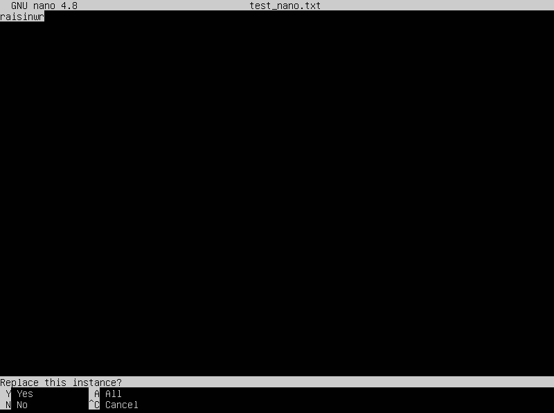

## Part 1. Установка ОС

- Узнать версию Ubuntu, выполнив команду `cat /etc/issue`.
- Скриншот с выводом команды: \
	

## Part 2. Создание пользователя

- Скриншот вызова команды для создания пользователя. Пользователь должен быть добавлен в группу `adm`. \
	Команда для создания и добавления пользователя в группу `adm` : `sudo useradd -G <group_name> <username>`. \
	
- Проверить, что пользователь успешно добавлен. Скриншот с результатом вывода. \
	Команда: `cat /etc/passwd`. \
	

## Part 3. Настройка сети ОС

- Задать имя машины вида `user-1`. \
	Команда для изменения имени машины: `sudo hostnamectl set-hostname <name>`. \
	
- Установить временную зону, соответствующую текущему местоположению. \
	Команда для установки врменной зоны: `sudo timedatectl set-timezone <name-timezone>`. \
	
- Вывести названия сетевых интерфейсов с помощью консольной команды. \
	Для вывода сетевых интерфейсов воспользуемся следующей командой, она просто выводит список всех интерфейсов: `ls /sys/class/net`. \
	 \
	Для более подробной информации воспользуемся утилитой `ifconfig`. Для этого необходимо установить `net-tools`: `sudo apt install net-tools`. \
	
	> **lo interface** (loopback) - виртуальный сетевой интерфейс на компьюетере, который "указывает" на сам компьютер. Он может использоваться для проверки, тестирования, настройки сетевых приложений и сервисов без реального подключения к другим компьютерам или сетям. С этим интерфейсом связан адрес 127.0.0.1 (`localhost`).
- Получить `ip-адрес` устройства, на котором происходит работа, от `DHCP` сервера, с помощью консольной команды. \
	Команда для отображения `ip-адреса`: `hostname -I` (`-I` - отображение всех сетевых адресов). \ 
	
	> **DHCP (Dynamic Host Configuration Protocol)** - протокол прикладного уровня модели TCP/IP, благодаря которому клиенты в автоматическом режиме получают ip-адреса и другие настройки для подключения и обмена информацией.
- Вывести на экран внешний `ip-адрес` шлюза и внутренний `ip-адрес` адрес шлюза (он же `ip-адрес` по умолчанию - `gw`). \
	Команда для получения внешнего `ip-адреса`: `curl ifconfig.me/ip`. \
	 \
	Команда для получения внутреннего `ip-адреса`: `ip route`. \
	
- Задать статичные настройки `ip`, `gw`, `dns` (использовать публичные `DNS серверы`, например, `1.1.1.1` или `8.8.8.8`). \
	Для задания статичных `ip-адресов` откроем конфигурационный файл на редактирование: `sudo vim 00-installer-config.yaml`, который находится в папке `/etc/netplan`. \
	Файл до внесения изменений: \
	 \
	Файл после внесения изменений: \
	 \
	После того, как все изменения были внесены, применим их и перезапустим систему: `sudo netplan apply`. \
	 \
	Убедимся в том, что изменения успешно применились. \
	 \
	Пропингуем `1.1.1.1` и `ya.ru`. \
	

## Part 4. Обновление ОС

- Обновить системные пакеты до последней версии. \
	Для обновления системных пакетов выполним команду: `sudo apt-get upgrade`. \
	

## Part 5. Использование команды sudo

> **Sudo** - команда, которая временно наделяет правами суперпользователя. Её использует для задач администрирования и настройки системы с максимально доступными правами.

- Разрешить пользователю, созданному в [**Part 2**](#part-2-создание-пользователя) (raisinwr_copy), выполнять команду `sudo`. \
	Разрешим пользователю `raisinwr_copy` выполнение команды `sudo`: `sudo usermod -aG sudo raisinwr_copy`. \
	После этого проверим, что он действительно имеет доступ к команде `sudo`. Для этого изменим `hostname` от его имени: `sudo -u raisinwr_copy hostnamectl set-hostname raisinwr_copy-1`. \
	

## Part 6. Установка и настройка службы времени

- Настроить службу автоматической синхронизации времени.
- Вывести время часового пояся, в котором сейчас находимся.
- Скриншот с результатом вывода команды `timedatectl show` (вывод должен содержать `NTPSynchronized=yes`). \
	

## Part 7. Установка и использование текстовых редакторов

### Задание 1

- Установить текстовые редакторы `VIM` (+ любые два по желанию `NANO`, `MCEDIT`, `JOE` и т.д.). \
	Для установки воспользуемся командой: `sudo apt install vim nano mcedit`. \
	

### Задание 2

- Используя каждый из трех выбранных редакторов, создать файл `test_X.txt`, где `X` - название редактора, в котором создан файл. Написать в нём свой никнейм, закрыть файл с сохранением изменений. \
	 **VIM**: `vim test_vim.txt`. Для выхода: `ESC` -> `:wq` (`w - write`, `q - quit`). \
	 \
	 **NANO**: `nano test_nano.txt`. Для выхода: `^X` (`ctrl`+`x`). \
	 \
	 **MCEDIT**: `mcedit test_mcedit.txt`. Для сохранения: `F2`, для выхода: `F10`. \
	

### Задание 3

- Используя каждый из трех выбранных редакторов, открыть файл на редактирование, отредактировать файл, заменив никнейм на строку «21 School 21», закрыть файл без сохранения изменений. \
	 **VIM** Для выхода без изменений: `:q!` (`force quit`). \
	 \
	 **NANO** Для выхода без изменений: `^X` (`ctrl`+`x`) -> `N` (`No`). \
	 \
	  **MCEDIT** Для выхода без изменений: `F10` -> `No`. \
	

### Задание 4

- Используя каждый из трех выбранных редакторов, отредактировать файл ещё раз (по аналогии с предыдущим пунктом), а затем освоить функции поиска по содержимому файла (слово) и замены слова на любое другое. \
	 **VIM** **Поиск** Для поиска открываем файл на редактирование и через `/<word>` выполняем поиск. \
	
	 **Замена** Для замены выполняем команду: `%s/<search_phrase>/<replace_phrase>/g`. `%` - замена будет выполняться во всем файле от первой строки до последней. `g` - замена всех вхождений в текущей строке. \
	

	 **NANO** **Поиск** Для поиска открываем файл на редактирование и нажимаем `^W` (`ctrl`+`w`), после этого вводим то, что хотим найти. \
	
	 **Замена** Для замены необходимо нажать `^\` (`ctrl`+`\`). \
	
	 После этого вводим то, что хотим заменить. \
	
	 Вводим то, на что хотим заменить. \
	
	 Подтверждаем действие нажатием `Y` (`Yes`). \
	
	 Получаем результат. \
	

	 **MCEDIT** **Поиск** Для поиска открываем файл на редактирование и нажимаем `F7`, после этого вводим то, что хотим найти. \
	
	 **Замена** Для замены необходимо нажать `F4`, ввести то, что хотим заменить и то, на что заменить. \
	
	 Нажать `Yes` -> `All` и получить результат. \
	

## Part 8. Установка и базовая настройка сервиса SSHD

- Установить службу `SSHd`.
	1. Обновить репозиторий: `sudo apt update`.
	2. Установить `SSH`: `sudo apt-get install ssh`.
	3. Установить `OpenSSH`: `sudo apt install openssh-server`.
- Добавить автостарт при запуске системы: `sudo systemctl enable sshd`.
- Проверим работу `SSH`: `systemctl status sshd`. \
	
- Перенастроить службу `SSHd` на порт 2022. \
	Для этого откроем конфигурационный файл через текстовый редактор `vim`: `sudo vim /etc/ssh/sshd_config` и заменим, используемый там порт `22` на `2022`. После этого перезапустим систему \
	
- Используя команду `ps` показать наличие процесса `sshd`. \
	Отобразим все процессы на `Linux` с помощью флага `-e` и через утилиту `grep` выберем процесс `sshd`: `ps -e | grep sshd`. \
	
- Перезапустим систему командой: `reboot`.
- Вывод команды `netstat -tan`. \
	
	> Команда **netstat** отображает различную сетевую информацию, такую как сетевые подключения, статистику интерфейсов, таблицы маршрутизации и т.д.  **Значения ключей -tan** **-t** - отображение соединения только по TCP. **-a** - отображение состояния всех активных сокетов, которые ожидают или не ожидают подключения (программных интерфейсов для обеспечения обмена данными между процессами). **-n** - отображает IP-адреса, вместо названия хостов.  **Значение столбцов** **Proto** - протокол, используемый сокетом (tcp, udp, raw). **Recv-Q** - количество байт, не скопированных программой пользователя из этого сокета. **Send-Q** - количество байт, не подтвержденных удаленным хостом. **Local Address** - адрес и номер порта локального конца сокета. **Foreign Address** - адрес и номер порта удалённого конца сокета. **State** - состояние сокета (в данном случае **LISTEN**, что означает, что сокет ожидает входящих подключений).  **0.0.0.0** - в таблице обозначает "любой адрес", соединении могут использовать все IP-адреса, существующие на данном компьютере.

## Part 9. Установка и использование улитилит **top**, **htop**

- Установить и запустить утилиты `top` и `htop`. \
	
- По выводу команды определить:
	- **uptime** : `26 min`
	- **Количество авторизованных пользователей** : `1`
	- **Общую нагрузку системы** : `0.00, 0.00, 0.00` *(1-е значение - количество процессов, готовых к запуску за последнюю минуту, 2-е значение - за 5 минут, 3-е значение - за 15 минут)*.
	- **Общее количество процессов** : `100 total` *(1 running, 99 sleeping, 0 stopped, 0 zombie)*.
	- **Загрузку cpu** : `0.0 us, 0.0 sy, 0.0 ni, 99.8 id, 0.2 wa, 0.0 hi, 0.0 si, 0.0 st`
	- **Загрузку памяти** : `3920.0 (total), 3364.2 (free), 154.6 (used)`
	- **Pid процесса занимающего больше всего памяти** : `1048` (`shift`+`m` - отсортировать по используемой памяти). \
	
	- **Pid процесса, занимающего больше всего процессорного времени** : `1` \
	
- Вставить скриншот с выводом команды `htop`. \
	
	- **Отсортированный по `PID`.**  `htop --sort-key PID` \
	
	- **Отсортированный по `PERCENT_CPU`.**  `htop --sort-key PERCENT_CPU` \
	
	- **Отсортированный по `PERCENT_MEM`.**  `htop --sort-key PERCENT_MEM` \
	
	- **Отсортированный по `TIME`.**  `htop --sort-key TIME` \
	
	- **Отфильтрованному для процесса `sshd`.** \
	
	- **С процессом `syslog`, найденным, используя поиск.** \
	
	- **С добавленным выводом `hostname`, `clock` и `uptime`.** \
	
	

## Part 10. Использование утилиты **fdisk**

- Запустить команду `fdisk -l`. \
	
	- **Название жетского диска** : `VBOX HARDDISK`
	- **Размер жесткого диска** : `10 GiB`
	- **Количество секторов** : `20971520`
	- **Swap** : `файл подкачки отсутствует`

## Part 11. Использование утилиты **df**

- Запустить команду `df`. \
	
	- **Размер корневого раздела** : `10215700`
	- **Размер занятого пространства корневого раздела** : `2889360`
	- **Размер свободного пространства корневого раздела** : `6785824`
	- **Процент использования корневого раздела** : `30%`
	- **Единица измерения** : по умолчанию используется `KiB`

- Запустить команду `df -Th`. \
	
	- **Размер корневого раздела** : `9.8G`
	- **Размер занятого пространства корневого раздела** : `2.8G`
	- **Размер свободного пространства корневого раздела** : `6.5G`
	- **Процент использования корневого раздела** : `30%`
	- **Тип файловой системы** : `ext4`

## Part 12. Использование утилиты **du**

- Запустить команду `du`. \
	
- Вывести размер папок `/home`, `/var`, `/var/log` : `du -sh <folder_name>` (`-h` - human-readable, `-s` - summarize). \
	
- Вывести размер всего содержимого в `/var/log`. \
	

## Part 13. Установка и использование утилиты **ncdu**

- Установить утилиту `ncdu` : `sudo apt install ncdu`.
- Вывести размер папок `/home`, `/var`, `/var/log`. 
	- `sudo ncdu /home/` \
		
	- `sudo ncdu /var/` \
		
	- `sudo ncdu /var/log/` \
	

> `/home` : 128.0 KiB `/var/` : 831.3 MiB `/var/log/` : 127.4 MiB

## Part 14. Работа с системными журналами

- Открыть для просмотра.
	- `/var/log/dmesg` \
	
	- `/var/log/syslog` \
	
	- `/var/log/auth.log` \
	
> **Время последней успешной авторизации** : `22:50:31` **Bмя пользователя** : `raisinwr` **Метод входа в систему** : `LOGIN`

- Перезапустить службу `SSHd` : `sudo systemctl restart sshd`. \
	

## Part 15. Использование планировщика заданий **CRON**

- Используя планировщик заданий, запустить команду `uptime` через каждые 2 минуты.
	- Открыть файл планировщица задач: `crontab -e` и выбрать текстовый редактор, например `vim`. Вписываем необходимую задачу (`*/2` - выполнение каждые 2 минуты). \
	
	- Найти в системных журналах строчки (минимум две в заданном временном диапазоне) о выполнении: `grep -i uptime /var/log/syslog`. \
	
- Удалить все задания из планировщика заданий: `crontab -r`. \
	
