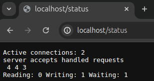
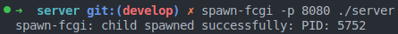
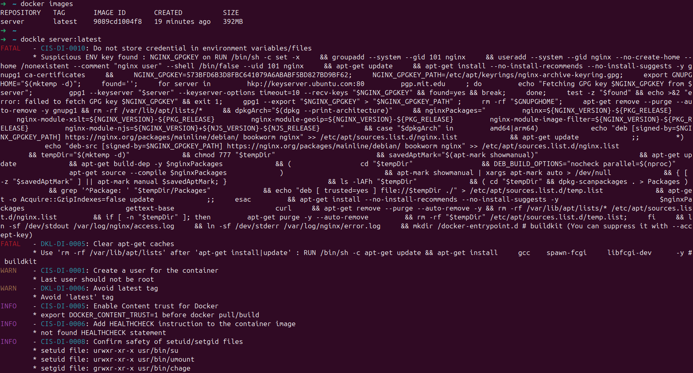
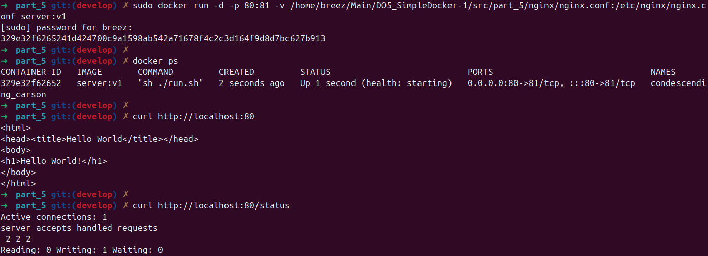

## SimpleDocker

## Содержание

- [Part 1. Готовый докер](#part-1-готовый-докер)

- [Part 2. Операции с контейнером](#part-2-операции-с-контейнером)

- [Part 3. Мини веб-сервер](#part-3-мини-веб-сервер)

- [Part 4. Свой докер](#part-4-свой-докер)

- [Part 5. Dockle](#part-5-dockle)

- [Part 6. Базовый Docker Compose](#part-6-базовый-docker-compose)

## Part 1. Готовый докер

- Взять официальный докер-образ с **nginx** и выкачать его с помощью `docker pull`.

	

- Проверить наличие докер-образа через `docker images`.

	

- Запустить докер-образ через `docker run -d [image_id|repository]`.

	

	> Флаг **-d** указывает докеру, что контейнер должен быть запущен в фоновом режиме (detached mode).

- Проверить, что образ запустился через `docker ps`.

	

- Посмотреть информацию о контейнере через `docker inspect [container_id|container_name]`.

	

- По выводу команды определить и поместить в отчёт **размер контейнера**, **список замапленных портов** и **ip контейнера**.

	- Размер контейнера

		

		> **Результаты данного вывода:**<br>**ShmSize** - размер выделяемой памяти для контейнера (shared memory)<br>**SizeRW** - размер измененных данных внутри контейнера<br>**SizeRootFs** - общий размер файловой системы контейнера<br>Общий размер контейнера считается, как сумма **SizeRootFs** и **SizeRw**

	- Список замапленных портов
		
		

		> **Замапленные порты** в докере нужно для перенаправления трафика с определенного порта хоста на порт внутри контейнера

	- IP контейнера

		

- Остановить докер-образ через `docker stop [container_id|container_name]`.

	

- Проверить, что образ остановился через `docker ps`.

	

- Запустить докер с портами `80` и `443` в контейнере, замапленными на такие же порты на локальной машине, через команду `run`.

	

	> В данной команде флаг **-p** используется для указания портов в виде пары:<br> **порт на локальной машине:порт внутри контейнера**

- Проверить, что в браузере по адресу `localhost:80` доступна стартовая страница `nginx`.

	

- Перезапустить докер-контейнер через `docker restart [container_id|container_name]` и проверить, что контейнер перезапустился через `docker ps`.

	

## Part 2. Операции с контейнером

- Прочитать конфигурационный файл `nginx.conf` внутри докер контейнера через команду `exec`.

	

- Создать на локальной машине файл `nginx.conf`.

	

- Настроить в нем по пути `/status` отдачу страницы статуса сервера `nginx`.

	Для выполнения этого задания необходимо закомментировать строку `include /etc/nginx/conf.d/*.conf`, чтобы сервер `nginx`брал настройки только из созданного нами файла и добавить в конфигурационный файл следующую запись:

	```
	server {
        listen 80;

        location /status {
            stub_status on;
        }
    }
	```

	Таким образом, итоговый файл `nginx.conf` будет выглядеть следующим образом:

	

	> **stub_status** - модуль **Nginx**, который предоставляет статус сервера в виде текстовой страницы.

-  Скопировать созданный файл `nginx.conf` внутрь докер-образа через команду `docker cp`.

	

- Перезапустить `nginx` внутри докер-образа через команду `exec`.

	

- Проверить, что по адресу `localhost:80/status` отдается страничка со статусом сервера `nginx`.

	

	> **Результаты вывода статуса Nginx:**<br>**Active connections** - количество всех открытых соединений<br>**Server accepts handled requests** имеет в себе три параметра (первый - количество принятых соединений, второй - количество прерванных соединений, третий - количество обрабатывающихся запросов)<br>**Reading** - количество соединений, в которых Nginx читает заголовки запроса от клиента<br>**Writing** - количество соединений, в которых `Nginx` отправляет ответ клиенту<br>**Waiting** - количество открытых соединений, которые находятся в режиме ожидания

- Экспортировать контейнер в файл `container.tar` через команду `export`.

	

- Остановить контейнер.

	

- Удалить образ через `docker rmi [image_id|repository]`, не удаляя перед этим контейнеры.

	

- Удалить остановленный контейнер.

	

- Импортировать контейнер обратно через команду `import`.

	

- Запустить импортированный контейнер.

	

- Проверить, что по адресу `localhost:80/status` отдается страничка со статусом сервера `nginx`.

	

## Part 3. Мини веб-сервер

- Написать мини-сервер на `C` и `FastCgi`, который будет возвращать простейшую страничку с надписью `Hello World!`.

	Для выполнения этого задания создадим файл `server.c` и пропишем в нем логику страницы с отображением текста `Hello World!`:

	```
	#include <stdio.h>
	#include "fcgi_stdio.h"

	int main(void) {
		while (FCGI_Accept() >= 0) {
			printf("Content-type: text/html");
			printf("<html>");
			printf("<head><title>Hello World!</title></head>");
			printf("<body><h1>Hello World!</h1></body>");
			printf("</html>");
		}
		return 0;
	}
	```

- Запустить написанный мини-сервер через `spawn-fcgi` на порту `8080`.

	

- Написать свой `nginx.conf`, который будет проксировать все запросы с `81` порта на `127.0.0.1:8080`.

	Для выполнения этого задания добавим в файл конифгурации `nginx.conf` следующую запись, которая будет принимать все запросы с порта `81` (параметр `listen`) на `127.0.0.1:8080` (параметр `fastcgi_pass`, который указывает на то, что все запросы FastGCI-приложения должны будут передаваться на порт `8080`):

	```
	user  nginx;
	worker_processes  auto;

	error_log  /var/log/nginx/error.log notice;
	pid        /var/run/nginx.pid;


	events {
		worker_connections  1024;
	}


	http {
		include       /etc/nginx/mime.types;
		default_type  application/octet-stream;

		log_format  main  '$remote_addr - $remote_user [$time_local] "$request" '
						'$status $body_bytes_sent "$http_referer" '
						'"$http_user_agent" "$http_x_forwarded_for"';

		access_log  /var/log/nginx/access.log  main;

		sendfile        on;

		keepalive_timeout  65;

		server {
			listen 81;

			location / {
				fastcgi_pass 127.0.0.1:8080;
			}
		}
	}
	```

- Проверить, что в браузере по `localhost:81` отдается написанная страничка.

	Необходимо внести изменения в файл конифграции `nginx` на локальной машине, перезапустить службу `nginx` и проверить, что от сервера возвращается корректный ответ:

	

	

	**Запуск через контейнер**
	
	Для выполнения этого задания запустим докер-контейнер с `nginx`:

	

	После этого необходимо скопировать файлы конфигурации (`nginx.conf`) и кода с мини-сервером (`server.c`):

	

	Заходим в терминал контейнера и запускаем сервер:

	

	
	
	После этого проверяем страницу браузера:

	

## Part 4. Свой докер

- Написать свой докер-образ, который:

	1. собирает исходники мини сервера на FastCgi из [Части 3](#part-3-мини-веб-сервер)

	2. запускает его на 8080 порту

	3. копирует внутрь образа написанный `./nginx/nginx.conf`

	4. запускает `nginx`

	Для выполнения этого задания первым делом напишем `Dockerfile`:

	```
	FROM nginx:latest

	WORKDIR /home

	COPY ./nginx/nginx.conf /etc/nginx
	COPY ./server.c .
	COPY ./run.sh .

	RUN apt-get update && apt-get install \
		gcc \
		spawn-fcgi \
		libfcgi-dev \
		-y

	CMD ["sh", "./run.sh"]
	```

	> В данном `Dockerfile` представлены следующие параметры:<br>**FROM** - указывает `Docker`, что нужно использовать официальный образ `nginx` с тегом `latest` в качестве базового образа, который содержит сконфигурированный сервер `nginx`<br>**WORKDIR** - определение рабочей директории внутри контейнера<br>**COPY** - копирование файлов из локальной машины внутрь контейнера (если в качестве второго параметра при копировании указывается `.`, то это значит, что файл копируется в `WORKDIR`)<br>**RUN** - запуск необходимых команд внутри контейнера, в данном случае происходит обновление пакетов и последующая установка необходимых зависимостей для запуска сервера<br>**CMD** - инструкция для определения команды при запуске контейнера

	Скрипт `run.sh` выглядит следующим образом:

	```
	#!/bin/bash

	gcc server.c -o server -lfcgi
	spawn-fcgi -p 8080 ./server
	nginx -g 'daemon off;'
	```

	> Данный скрипт содержит следующие команды:<br>**`gcc server.c -o server -lfcgi`** - компиляция файла сервера<br>**`spawn-fcgi -p 8080 ./server`** - запуск сервера на порту `8080`<br>**`nginx -g 'daemon off;'`** - запуск в режиме для отслеживания состояния (не в фоне)

- Собрать написанный докер-образ через `docker build` при этом указав `имя` и `тег`.

	Для выполнения этого задания необходимо перейти в папку, в которой находится `Dockerfile` для сборки образа и выполнить следующую команду:

	```
	docker build -t server:latest .
	```

	> Команда `docker build` собирает образ на основе инструкций из `Dockerfile`.<br>С помощью флага `-t` задается сначала имя образа, перед двоеточием (в данном случае `server`) и тег, после двоеточия (в данном случае `latest`).<br>Точка в конце `.` означает, что докер будет искать `Dockerfile` в текцщей директории.

	

- Проверить через `docker images`, что все собралось корректно.

	Как можно заметить по выводу команды, образ успешно собрался:

	

- Запустить собранный докер-образ с `маппингом 81 порта на 80 на локальной машине` и `маппингом папки ./nginx внутрь контейнера` по адресу, где лежат конфигурационные файлы `nginx`'а (см. [Часть 2](#part-2-операции-с-контейнером)).

	Для выполнения этого задания необходимо выполнить следующую команды для запуска контейнера на основе созданного образа:

	```
	docker run -d -p 80:81 -v /home/breez/Main/DO5_SimpleDocker-1/src/part_4/nginx/nginx.conf:/etc/nginx/nginx.conf server:latest
	```

	> В данной команде присутсвуют следующие параметры:<br>**Флаг `-d`** - используется для того, чтобы указать докеру, что контейнер должен быть запущен в фоновом режиме.<br>**Флаг `-p 80:81`** - показывает докеру, что необходимо выполнить маппинг порта 81 в контейнере на 80 порт на локальной машине (это необходимо, потому что в конфигурационном файле `nginx.conf` сервер стоит на прослушивание `81` порта).<br>**Флаг `-v`** - указывает на то, что необходимо перенести папку с хоста в контейнер.<br>**server:latest** - указывает, какой образ необходимо использовать для запуска контейнера.

	

- Проверить, что по `localhost:80` доступна страничка написанного мини сервера.

	

- Дописать в `./nginx/nginx.conf` проксирование странички `/status`, по которой надо отдавать статус сервера `nginx`.

	Необходимо добавить в `./nginx/nginx.conf` ледующие строки:

	```
	location /status {
		stub_status on;
	}
	```

	Таким образом `./nginx/nginx.conf` будет выглядеть:

	

- Перезапустить докер-образ.

	Для выполнения этого задания сначала нужно остановить запущенный контейнер с помощью команды `docker stop <container id>`, а затем снова запустить `docker start <container id>`.

	

- Проверить, что теперь по `localhost:80/status` отдается страничка со статусом `nginx`.

	Сначала необходимо проверить, что отображается обычная страница.

	

	

	А теперь нужно проверить, что возвращается страница `localhost:80/status`.

	

	

## Part 5. Dockle

- Просканировать образ из предыдущего задания через `dockle [image_id|repository]`.

	Для выполнения этого задания сначала необходимо установить утилиту `dockle` из [репозитория](https://github.com/goodwithtech/dockle). Можно скачать `.deb` пакет и установить его.

	

	После успешной установки можно выполнить сканирование образа из [части 4](#part-4-свой-докер), используя команду `dockle server:latest`.

	

	>Полученные ошибки:<br>**CIS-DI-0010:** Do not store credential in environment variables/files<br>**DKL-DI-0005:** Clear apt-get caches<br>**CIS-DI-0001:** Create a user for the container<br>**DKL-DI-0006:** Avoid latest tag<br>**CIS-DI-0005:** Enable Content trust for Docker<br>**CIS-DI-0006:** Add HEALTHCHECK instruction to the container image<br>**CIS-DI-0008:** Confirm safety of setuid/setgid files

- Исправить образ так, чтобы при проверке через `dockle` не было ошибок и предупреждений.

	Для исправления ошибок `CIS-DI-0010`, `DKL-DI-0005`, `CIS-DI-0008` было принято решение изменить исходный образ, от которого будет собираться наш образ с `nginx` на легковесную `alpine`, в которую впоследствии будет устанавливаться `nginx`.
	
	Для исправления ошибки `DKL-DI-0006` докер-образ собирается с тегом `v1`, то есть команда для сборки будет выглядеть следующим образом:

	```
	docker build -t server:v1 .
	```

	Для исправления ошибки `CIS-DI-0001` добавим пользователя `USER nginx` в `Dockerfile`. В противном случае, если добавлять другого пользователя, отличного от `nginx`, то придется перенастраивать `nginx.conf` с доступам к папкам. Также в этом случае нужно вынести компиляцию файла с мини-сервером в `Dockerfile` и создание директории для процессов, которые имеют к ней доступ:

	```
	RUN gcc server.c -o server -lfcgi && \
    chmod +x run.sh && \
    mkdir -p /var/run/nginx && chown -R nginx:nginx /var/run/nginx
	```

	Для исправления ошибки `CIS-DI-0005` неоходимо выполнить команду, которая предоставляет возможность использовать цифровые подписи для данных:

	```
	export DOCKER_CONTENT_TRUST=1
	```

	Для исправления ошибки `CIS-DI-0006` нужно добавить в `Dockerfile` команду для проверки состояния контейнера:

	```
	HEALTHCHECK --interval=5m --timeout=3s CMD curl -f http://localhost/ || exit 1
	```

	>Параметры команды:<br>**--interval=5m** - проверки происходят с интервалом в 5 минут<br>**--timeout=3s** - установка временного лимита для выполнения команды проверки состояния<br>**CMD curl -f http://localhost/ || exit 1** - команда для проверки состояния, которая отправляет запрос на `localhost`, если же ответ не возвращается, то выполнится команда `exit 1`, что будет указывать на неудачную проверку состояния.

	Итоговый `Dockerfile` выглядит следующим образом:

	```
	FROM alpine

	WORKDIR /home

	RUN apk update && apk add --no-cache \
		nginx \
		build-base \
		spawn-fcgi \
		fcgi \
		fcgi-dev

	COPY ./nginx/nginx.conf /etc/nginx/nginx.conf
	COPY ./server.c .
	COPY ./run.sh .

	RUN gcc server.c -o server -lfcgi && \
		chmod +x run.sh && \
		mkdir -p /var/run/nginx && chown -R nginx:nginx /var/run/nginx

	USER nginx

	CMD ["sh", "./run.sh"]

	HEALTHCHECK --interval=5m --timeout=3s CMD curl -f http://localhost/ || exit 1
	```

	После того, как все изменения были внесены, `dockle` больше не показывает ошибок и предупреждений:

	

	Проверим работоспособность, запустим контейнер из образа и посмотрим вывод.

	

## Part 6. Базовый **Docker Compose**

- Написать файл `docker-compose.yml`, с помощью которого:

	1. Поднять докер-контейнер из [Части 5](#part-5-dockle) (он должен работать в локальной сети, т.е. не нужно использовать инструкцию `EXPOSE` и мапить порты на локальную машину).

	2. Поднять докер-контейнер с `nginx`, который будет проксировать все запросы с `8080` порта на `81` порт первого контейнера.

	Замапить `8080` порт второго контейнера на `80` порт локальной машины.

	Для выполнения этого задания необходимо написать следующий `docker-compose.yml`:

	```
	version: '3.8'

	services:
		server:
			build: ../part_5

		nginx:
			image: nginx:latest
			volumes:
				- ./nginx/nginx.conf:/etc/nginx/nginx.conf
			ports:
      			- 80:8080
			command: /bin/sh -c "mkdir -p /var/run/nginx && nginx -g 'daemon off;'"
	```
	>Команды:<br>**build: ../part_5** - `docker-compose` должен собрать образ для сервиса `server` из директории предыдущей части проекта: [части 5](#part-5-dockle), только в этот раз не происходит маппинг портов при запуске контейнера, как это было в предыдущем пункте.<br>**nginx** - происходит сборка сервиса `nginx` на основе образа `nginx:latest` (`image: nginx:latest`), привязка локального файла `./nginx/nginx.conf` к конфигурационному файлу внутри контейнера (`volumes: ./nginx/nginx.conf:/etc/nginx/nginx.conf`), маппинг порта контейнера `8080` на `80` порт локальной машины, запуск контейнера с созданием папки конфигурации (`command: /bin/sh -c "mkdir -p /var/run/nginx && nginx -g 'daemon off;`)

	Также необходимо изменить файл конфигурации `nginx.conf`, добавив в него следующую запись:

	```
	server {
        listen 8080;
        
        location / {
            proxy_pass http://server:81;
        }
    }
	```

- Остановить все запущенные контейнеры.

	

- Собрать и запустить проект с помощью команд `docker-compose build` и `docker-compose up`.

	

	

- Проверить, что в браузере по `localhost:80` отдается написанная тобой страничка, как и ранее.

	

	
