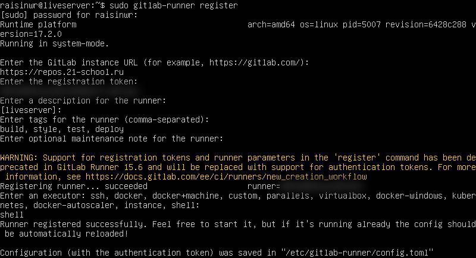
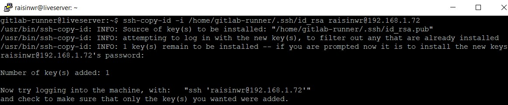

## Basic CI/CD

## Содержание

- Part 1. [Настройка gitlab-runner](#part-1-настройка-gitlab-runner)
- Part 2. [Сборка](#part-2-сборка)
- Part 3. [Тест кодстайла](#part-3-тест-кодстайла)
- Part 4. [Интеграционные тесты](#part-4-интеграционные-тесты)
- Part 5. [Этап деплоя](#part-5-этап-деплоя)
- Part 6. [Дополнительно. Уведомления](#part-6-дополнительно-уведомления)

## Part 1. Настройка **gitlab-runner**

- Поднять виртальную машину `Ubuntu Server 22.04 LTS`.

	

- Скачать и установить на виртуальную машину `gitlab-runner`.

	Для установки `gitlab-runner` на `Ubuntu` сначала необходимо добавить оффициальный репозиторий `GitLab`:
	```shell
	curl -L "https://packages.gitlab.com/install/repositories/runner/gitlab-runner/script.deb.sh" | sudo bash
	```

	

	``` shell
	sudo apt-get install gitlab-runner
	```
	
	

- Запустить `gitlab-runner` и зарегистрировать его для использования в текущем проекте (*DO6_CICD*).

	Для выполнения регистрации `gitlab-runner` для использования в текущем проекте необходимо выполнить команду:

	``` shell
	sudo gitlab-runner register
	```

	Данные для `GitLab URL` и `registration token` необходимо взять со страницы проекта.

	

	Поле `tags` можно заполнить этапами, которые будут происходить в проекте, в данном случае: `build`, `style`, `test`, `deploy`.

	В качестве `executor` необходимо выбрать `shell`.
	
	

## Part 2. Сборка

Для более удобного использования сервера линукс можно подключиться к нему через программу `PuTTY`.

Написать этап для **CI** по сборке приложения из проекта *C3_SimpleBashUtils*.

- В файле `gitlab-ci.yml` добавить этап запуска сборки через мейк файл из проекта *C3*.

- Файлы, полученные после сборки (артефакты), сохранить в произвольную директорию со сроком хранения 30 дней.

	Первым делом нужно склонировать оба проекта и перенести файлы из проекта `C3_SimpleBashUtils` в папку `src` текущего проекта.

	

	

	

	В корневой папке текущего проекта нужно создать файл `.gitlab-ci.yml`.

	``` YML
	stages:
  	  - build

	build-job:
	  stage: build
	  tags:
	    - build
	  script:
	    - cd ./src/cat
	    - make s21_cat
	    - cd ../grep
	    - make s21_grep
	  artifacts:
	    paths:
	      - ./src/cat/s21_cat
	      - ./src/grep/s21_grep
	    expire_in: 30 days
	```

	> После этого необходимо прописать все пункты для сборки проекта:<br>**stage** - указание на какой стадии будет выполняться данный этап<br>**tags** - метка для указания того, на каких раннерах должно выполняться текущее задание<br>**script** - определение команд на выполнение<br>**artifacts** - результирующие файлы (**paths** - пути, по которым они будут сохранены, **expire_in** - время, в течение которого они будут храниться).

	Также необходимо отметить, что перед пушем проекта на `GitLab` нужно установить необходимые зависимости на сервере для запуска проектов и последующих этапов:

	``` shell
	sudo apt install build-essential
	sudo apt install clang-format
	```

	После пуша проекта на `GitLab` необходимо проверить выполнение пайплайна и этапа сборки проекта.

	

	

	Как можно увидеть, сборка успешно завершилась и файлы (артефакты) сохранились в директории на 30 дней.

## Part 3. Тест кодстайла

Написать этап для **CI**, который запускает скрипт кодстайла (*clang-format*).

Аналогичным образом, как и в предыдущей части необходимо добавить проверку на стиль кода для проекта *C3_SimpleBashUtils*. Только теперь этап сборки будет `style` и в `script` будет прописана необходимая проверка на соответствие стилю (необходимо добавить флаг `--Werror`, чтобы работа завершалась в случае ошибки, а не продолжалась дальше).

``` YML
stages:
  - build
  - style

build-job:
  stage: build
  tags:
    - build
  script:
    - cd ./src/cat
    - make s21_cat
    - cd ../grep
    - make s21_grep
  artifacts:
    paths:
      - ./src/cat/s21_cat
      - ./src/grep/s21_grep
    expire_in: 30 days

style-job:
  stage: style
  tags: 
    - style
  script:
    - cd ./src/
    - clang-format --Werror -n ./cat/*.c ./cat/*.h ./grep/*.c ./grep/*.h
```

- Если кодстайл не прошел, то необходимо «зафейлить» пайплайн.

	Сначала можно специально допустить ошибку в код-стайле для того, чтобы проверить работоспособность на обнаружение ошибок и запушить проект.

	

	

	Как можно заметить `pipeline` зафейлился и не завершился до конца, ошибка произошла на этапе проверки стиля.

- В пайплайне отобразить вывод утилиты `clang-format`.

	Теперь необходимо исправить ошибки в код-стайле и проверить, что `pipeline` завершится до конца, не обнаружив никаких ошибок.

	

	

## Part 4. Интеграционные тесты

Написать этап для **CI**, который запускает твои интеграционные тесты из того же проекта.

- Запустить этот этап автоматически только при условии, если сборка и тест кодстайла прошли успешно.

	Для выполнения этого условия необходимо добавить этап для запуска предыдущих пунктов (сборки и проверки на код-стайл) перед запуском интеграционных тестов: `needs: ["build-job", "style-job"]`.

- Если тесты не прошли, то то необходимо «зафейлить» пайплайн.

	Сначала все также можно специально допустить ошибку в тестах, чтобы проверить работоспособность проверки при запуске `pipeline`.
	
	Можно попробовать напрямую через `linux` запустить тесты и посмотреть, что они выводят ошибку.

	

	После этого написать специальный скрипт, который будет запускать тесты, весь результат вывода записывать в текстовый файл и затем проверять, нашлись ли какие-либо ошибки. В случае их нахождения выводить на экран тесты, которые не прошли проверку.

	Скрипт для запуска и вывода результата тестов:
	``` bash
	#!/bin/bash

	set -e
	chmod +x ../cat/test_cat_func.sh ../grep/test_grep_func.sh

	# CAT tests
	cd ../cat
	./test_cat_func.sh > test_cat_func_result.txt 2>&1

	if grep -q "FAIL: 0" ./test_cat_func_result.txt; then
	  echo "Tests for cat passed"
	else
	  echo "Tests for cat failed"
	  grep "fail" ./test_cat_func_result.txt > failed_tests_cat.txt
	  cat failed_tests_cat.txt
	  exit 1
	fi

	# GREP tests
	cd ../grep
	./test_grep_func.sh > test_grep_func_result.txt 2>&1

	if grep -q "FAIL: 0" ./test_grep_func_result.txt; then
	  echo "Tests for grep passed"
	else
	  echo "Tests for grep failed"
	  grep "fail" ./test_grep_func_result.txt > failed_tests_grep.txt
	  cat failed_tests_grep.txt
	  exit 1
	fi
	```

	>**set -e** - указание на то, что скрипт завершает свое выполнение на команде, которая вернула результат, отличный от 0<br>**chmod +x *scripts*** - выдача разрешений на запуск скриптов для всех пользователей<br><br>При запуске скриптов, которые выполняют тесты, все результаты записываются в выходной файл формата `txt` (2>&1 - перенаправление стандартного вывода ошибок в тот же поток, что и стандартный вывод, то есть все сообщения об ошибках также будут записаны в тот же выходной файл).<br><br>После того, как все результаты будут записаны в выходной файл, выполняется поиск с помощью утилиты `grep` строки `FAIL`, если в результате никакие тесты не зафейлились (то есть `grep -q` вернул 0 на строку `FAIL: 0`), то на вывод поступает строка, что тесты успешно прошли, иначе строка о том, что произошли ошибки, и где именно они находятся.

	Теперь необходимо интегрировать запуск этого скрипта в файл `gitlab-ci.yml`:
	``` YML
	stages:
	  - build
	  - style
	  - test

	build-job:
	  stage: build
	  tags:
	    - build
	  script:
	    - cd ./src/cat
	    - make s21_cat
	    - cd ../grep
	    - make s21_grep
      artifacts:
	    paths:
	      - ./src/cat/s21_cat
	      - ./src/grep/s21_grep
	    expire_in: 30 days

	style-job:
	  stage: style
	  tags: 
	    - style
	  script:
	    - cd ./src/
	    - clang-format --Werror -n ./cat/*.c ./cat/*.h ./grep/*.c ./grep/*.h

	test-job:
	  stage: test
	  needs: ["build-job", "style-job"]
	  tags:
	    - test
	  script:
	    - cd ./src/scripts
	    - chmod +x integration_tests.sh
	    - ./integration_tests.sh
	```

	После этого можно проверить, что тесты не проходят проверку, запушив проект на ветку.

	

	

- В пайплайне отобразить вывод, что интеграционные тесты успешно прошли / провалились.

	На данный момент можно проверить вариант, когда все тесты успешно прошли проверку и в результате `pipeline` завершился. Для этого нужно исправить ошибку, специально допущенную в предудыщем пункте.

	

	

## Part 5. Этап деплоя

- Поднять вторую виртуальную машину.

	Необходимо поднять вторую виртуальную машину на базе `linux server`, на которой установим настройку сети - сетевой мост.

	

	Поскольку подключение ко второй виртуальной машине будет производиться с пользователя `gitlab-runner`, то необходимо авторизоваться под ним и сгенерировать `ssh-ключ` для подключения.

	

	После того, как ключ был сгенерирован его необходимо добавить в файл `~/.ssh/authorized-keys` на второй виртуальной машине следующей командой:

	``` shell
	ssh-copy-id -i /home/gitlab-runner/.ssh/id_rsa raisinwr@192.168.1.72
	```

	> **ssh-copy-id** - копирует `ssh-ключ` на удаленный сервер (флаг **-i**  нужен для явного указания пути до файла, где хранится `ssh-ключ`)

	

	После копирования проверим доступность второй машины по `ssh`:

	``` shell
	ssh raisinwr@192.168.1.72
	```

	

	Как можно увидеть, соединение успешно установилось.

Написать этап для **CD**, который «разворачивает» проект на другой виртуальной машине.

- Запустить этот этап вручную при условии, что все предыдущие этапы прошли успешно.
	
	Поскольку данный этап нужно запускать вручную, для этого нужно нужно указать параметр `when: manual` в файле `gitlab-ci.yml`. За копирование файлов будет отвечать файл `deploy.sh`. Также стоит отметить, что на данном этапе результаты вывода (логи работы) будут записаны в отдельный текстовый файл по пути `./src/logs/deploy_logs.txt`:
	``` YML
	stages:
	  - build
	  - style
	  - test
	  - deploy

	build-job:
	  stage: build
	  tags:
	    - build
	  script:
	    - cd ./src/cat
	    - make s21_cat
	    - cd ../grep
	    - make s21_grep
	  artifacts:
	    paths:
	    - src/cat/s21_cat
	    - src/grep/s21_grep
	    expire_in: 30 days

	style-job:
	  stage: style
	  tags: 
	    - style
	  script:
	    - cd src/
	    - clang-format --Werror -n cat/*.c cat/*.h grep/*.c grep/*.h

	  test-job:
	  stage: test
	  needs: ["build-job", "style-job"]
	  tags:
	    - test
	  script:
	    - cd ./src/scripts
	    - chmod +x integration_tests.sh
	    - ./integration_tests.sh

	deploy-job:
	  stage: deploy
	  needs: ["build-job", "style-job", "test-job"]
	  tags:
	    - deploy
	  when: manual
	  script:
	    - cd ./src/scripts/
	    - chmod +x deploy.sh
	    - ./deploy.sh > ../logs/deploy_log.txt 2>&1
	  artifacts:
	    paths:
	      - src/logs/deploy_log.txt
	    expire_in: 30 days
	```

- Написать `bash-скрипт`, который при помощи `ssh` и `scp` копирует файлы, полученные после сборки (артефакты), в директорию `/usr/local/bin` второй виртуальной машины.

- В файле `gitlab-ci.yml` добавить этап запуска написанного скрипта.

- В случае ошибки «зафейлить» пайплайн.

	При копировании возникает проблема прав доступа, она заключается в том, что `gitlab-runner` не может скопировать полученные артефакты на удаленную машину в `/usr/local/bin` и получает сообщение `Permission denied`.

	Для решении этой проблемы можно либо копировать файлы в какую-нибудь временную папку на удаленной машине, а после этого переносить их в `/usr/local/bin`, авторизовавшись под нужным пользователем с правами доступа, либо напрямую задать пользователя директории через команду `chown`.

	Необходимо прокинуть ключ авторизации для пользователя, под которым мы хотим заходить, для этого нужно зайти под пользователем `root` и скопировать ключ авторизации.

	

	Теперь нужно разблокировать в `sshd_config` параметры, которые позволят через `root` авторизоваться и скопировать нужные файлы: `sudo nano /etc/.ssh.sshd_config`

	> **PermitRootLogin prohibit-password** - разрешает подключение только по `ssh-ключу`, при этом запрещает аутентификацию по паролю<br>**AuthorizedKeysFile** - указывает пути к файлу, где хранятся публичные ключи для аутентификации по `ssh`

	

	В `bash-скрипте` сначала проверяется, существуют ли указанные файлы на локальной машине `gitlab-runner`, в случае если их нет, то скрипт выдает ошибку, а `pipeline` завершается. Если все файлы на месте, то после этого каждый из артефактов с помощью команды `scp` копируется на удаленную машину и выдается соответсвующее сообщение в случае, если копирование произошло успешно или копирование прервалось с ошибкой.

	``` bash
	#!/bin/bash

	remote_user="root"
	remote_host="192.168.1.72"
	remote_dir=/usr/local/bin

	artifacts=("../cat/s21_cat" "../grep/s21_grep")

	for artifact in "${artifacts[@]}"; do
	  if [ ! -e "$artifact" ]; then
	    echo "Error: $artifact doesn't exist"
	    exit 1
	  fi
	done

	for artifact in "${artifacts[@]}"; do
	  echo "Copying $artifact to $remote_user@$remote_host into $remote_dir"
	  if scp "$artifact" ${remote_user}@${remote_host}:${remote_dir}; then
	    echo -e "\033[32mSuccessfully copied\033[0m $artifact"
	  else
	    echo -e "\033[31mERROR: failed to copy\033[0m $artifact"
	    exit 1
	  fi
	done

	echo "Deployment completed successfully"
	```

	После пуша на ветку, можно проверить корректность работы. Как можно заметить, теперь перед выполнением `deploy-job` ожидается запуск этапа вручную.

	

	После запуска последнего этапа можно заметить, что `pipeline` успешно завершился и появился результирующий файл с логами работы.

	

	

	Необходимо скачать и проверить результаты работы (логи) по копированию.
	
	

	Также можно на удаленном сервере проверить директорию `/usr/local/bin` на наличие необходимых скопированных файлов (артефактов).

	

- Сохранить дампы образов виртуальных машин.

	

## Part 6. Дополнительно. Уведомления

- Настроить уведомления о успешном/неуспешном выполнении пайплайна через бота с именем «raisinwr DO6 CI/CD» в Telegram.

- Текст уведомления должен содержать информацию об успешности прохождения как этапа CI, так и этапа CD.

	Для выполнение этого задания сначала необходимо создать нового телеграмм бота и получить уникальный токен. Нужно найти в поиске телеграмма `BotFather` и через него создать нового бота под именем `raisinwr DO6 CI/CD`

	

	После того, как бот был успешно создан, нужно получить `id чата` с ним. Для этого необходимо открыть страницу `https://api.telegram.org/bot<Bot_Token>/getUpdates`.

	

	Для того, чтобы не отображать приватные данные в репозитории - токен бота и `id` чата, можно записать их в файл `tg_bot_conf.conf`, который будет расположен в корне машины с `gitlab_runner`.

	

	Теперь нужно написать скрипт, который будет брать данные токена и `id` чата из файла и отправлять соответствующее сообщение в зависимости от выполненной работы.

	``` bash
	#!/bin/bash

	source /home/gitlab-runner/tg_bot_config.conf

	if [ "$CI_JOB_STATUS" == "success" ]; then
	  MESSAGE="✅ Success%0A%0AProject name: $CI_PROJECT_NAME%0A%0ABranch: $CI_COMMIT_REF_NAME%0ACommit message: $CI_COMMIT_MESSAGE%0AStage: $CI_JOB_STAGE%0AJob $CI_JOB_NAME has been successfully completed%0A%0A$CI_PROJECT_URL/pipelines"
	else
	  MESSAGE="❌ Failure%0A%0AProject name: $CI_PROJECT_NAME%0A%0ABranch: $CI_COMMIT_REF_NAME%0ACommit message: $CI_COMMIT_MESSAGE%0AStage: $CI_JOB_STAGE%0AJob $CI_JOB_NAME ended with an error%0A%0A$CI_PROJECT_URL/pipelines"
	fi

	curl -X POST "https://api.telegram.org/bot${BOT_TOKEN}/sendMessage" -d "chat_id=${CHAT_ID}" -d "text=${MESSAGE}"
	```

	> **source** - получение переменных из файла<br>**curl -X POST** - явное указание того, что `HTTP-метод` для запроса должен быть `POST` (по умолчанию `curl` использует `GET`)<br>**-d** - используется для указания данных, которые должны быть отправлены на сервер

	Также необходимо добавить отправку сообщения об успехе/ошибке выполненого этапа в файл `gitlab-ci.yml`:
	``` yml
	stages:
      - build
      - style
      - test
      - deploy

	build-job:
	  stage: build
	  tags:
	    - build
	  script:
	    - cd ./src/cat
	    - make s21_cat
	    - cd ../grep
	    - make s21_grep
	  artifacts:
	    paths:
	      - src/cat/s21_cat
	      - src/grep/s21_grep
	    expire_in: 30 days
	  after_script:
	    - cd ./src/scripts/
	    - chmod +x notification.sh
	    - ./notification.sh

	style-job:
	  stage: style
	  tags: 
	    - style
	  script:
	    - cd src/
	    - clang-format --Werror -n cat/*.c cat/*.h grep/*.c grep/*.h
	  after_script:
	    - cd ./src/scripts/
	    - chmod +x notification.sh
	    - ./notification.sh

	test-job:
	  stage: test
	  needs: ["build-job", "style-job"]
	  tags:
	    - test
	  script:
	    - cd ./src/scripts
	    - chmod +x integration_tests.sh
	    - ./integration_tests.sh
	  after_script:
	    - cd ./src/scripts/
	    - chmod +x notification.sh
	    - ./notification.sh

	deploy-job:
	  stage: deploy
	  needs: ["build-job", "style-job", "test-job"]
	  tags:
	    - deploy
	  when: manual
	  script:
	    - mkdir ./src/logs
	    - cd ./src/scripts/
	    - chmod +x deploy.sh
	    - ./deploy.sh > ../logs/deploy_log.txt 2>&1
	  artifacts:
	    paths:
	      - src/logs/deploy_log.txt
	    expire_in: 30 days
	  after_script:
	    - cd ./src/scripts/
	    - chmod +x notification.sh
	    - ./notification.sh
	```

	После этого можно запушить проект и проверить отправку уведомлений.

	

	
